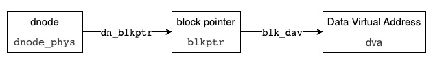
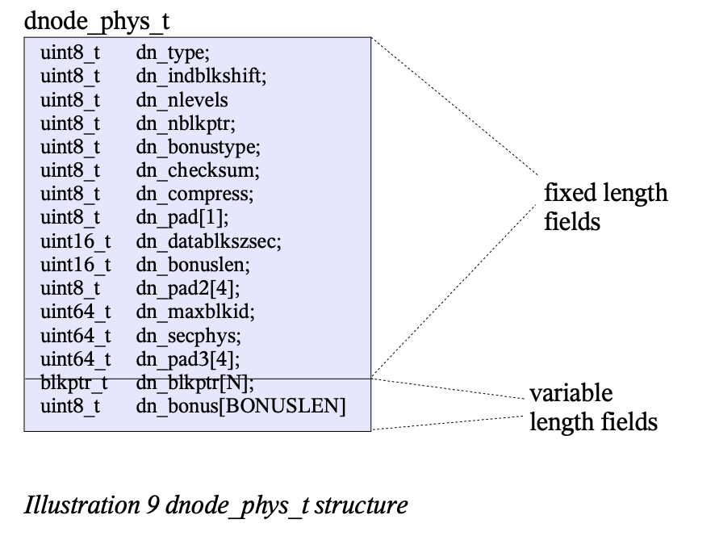
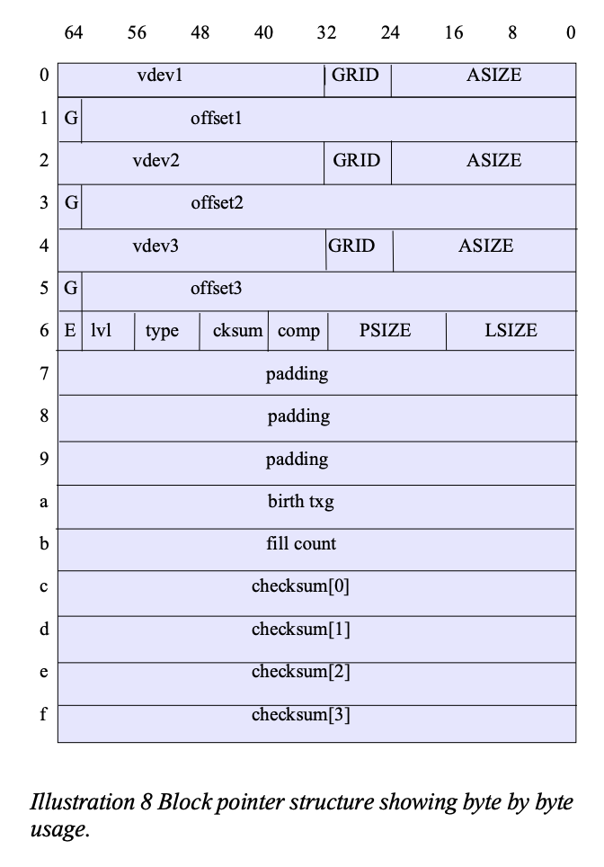

# Summary of Data Structures to be altered by my implementation of block reference pointers

The two main structures are dnode and block pointers
https://openzfs.org/wiki/Documentation/DnodeSync

## Illustration



## Dnode Description (`dnode_phys`)

### Defined in `./include/sys/dnode.h`

A ZFS dnode is a data structure which represents an object. An object can be a ZPL file or directory, a ZVOL volume, or several other types of internal metadata. A ZPL-type dnode serves a similar function to an inode in UFS and other filesystem. The dnode is managed by the DMU layer. The specific type of a dnode is stored in its dn_type field, which can be any of the following values:

### On-disk structure

"An object is stored on disk as a tree of block pointers. At its root is a `dnode_phys_t` structure containing the object's metadata: its type, number of levels in the tree of indirect blocks, whether there is a bonus buffer attached for extra meta-information, the amount of space used by this object, etc. The root of a dnode also contains block pointers which reference blocks on disk for storing the actual contents of this dnode object (for example, the information in a user file).

Given that the maximum size of a ZFS block is 128KB and the `dnode_phys_t` can only hold up to 3 block pointers, only 384KB of space can be directly referenced from a dnode. Obviously, this isn't enough space to store the vast majority of user files, and so indirect blocks were created. Indirect blocks are ZFS blocks which themselves store block pointers, as opposed to data blocks which store the actual data of the dnode. Data blocks can also be referred to as L0 blocks because they are at level=0 in a dnode, with their immediate parent indirect blocks being L1 blocks, and their parents being L2 blocks, etc. A simple diagram of a dnode with indirect blocks can be found in the ZFS On-Disk Format guide (keep in mind that while a block pointer represents a single logical block, it multiple physical copies may be stored, pointed to by the three DVAs in the block pointer)."



### Code, confused on the variable length assignemnt

```c
typedef struct dnode_phys {
    uint8_t dn_type;                /* dmu_object_type_t */
    uint8_t dn_indblkshift;         /* ln2(indirect block size) */
    uint8_t dn_nlevels;             /* 1=dn_blkptr->data blocks */
    uint8_t dn_nblkptr;             /* length of dn_blkptr */
    uint8_t dn_bonustype;           /* type of data in bonus buffer */
    uint8_t dn_checksum;            /* ZIO_CHECKSUM type */
    uint8_t dn_compress;            /* ZIO_COMPRESS type */
    uint8_t dn_flags;               /* DNODE_FLAG_* */
    uint16_t dn_datablkszsec;       /* data block size in 512b sectors */
    uint16_t dn_bonuslen;           /* length of dn_bonus */
    uint8_t dn_extra_slots;         /* # of subsequent slots consumed */
    uint8_t dn_pad2[3];

    /* accounting is protected by dn_dirty_mtx */
    uint64_t dn_maxblkid;           /* largest allocated block ID */
    uint64_t dn_used;               /* bytes (or sectors) of disk space */

    /*
        * Both dn_pad2 and dn_pad3 are protected by the block's MAC. This
        * allows us to protect any fields that might be added here in the
        * future. In either case, developers will want to check
        * zio_crypt_init_uios_dnode() and zio_crypt_do_dnode_hmac_updates()
        * to ensure the new field is being protected and updated properly.
        */
    uint64_t dn_pad3[4];
    /*
        * Both dn_pad2 and dn_pad3 are protected by the block's MAC. This
        * allows us to protect any fields that might be added here in the
        * future. In either case, developers will want to check
        * zio_crypt_init_uios_dnode() and zio_crypt_do_dnode_hmac_updates()
        * to ensure the new field is being protected and updated properly.
        */
    uint64_t dn_pad3[4];

    /*
        * The tail region is 448 bytes for a 512 byte dnode, and
        * correspondingly larger for larger dnode sizes. The spill
        * block pointer, when present, is always at the end of the tail
        * region. There are three ways this space may be used, using
        * a 512 byte dnode for this diagram:
        *
        * 0       64      128     192     256     320     384     448 (offset)
        * +---------------+---------------+---------------+-------+
        * | dn_blkptr[0]  | dn_blkptr[1]  | dn_blkptr[2]  | /     |
        * +---------------+---------------+---------------+-------+
        * | dn_blkptr[0]  | dn_bonus[0..319]                      |
        * +---------------+-----------------------+---------------+
        * | dn_blkptr[0]  | dn_bonus[0..191]      | dn_spill      |
        * +---------------+-----------------------+---------------+
        */
    union {
            blkptr_t dn_blkptr[1+DN_OLD_MAX_BONUSLEN/sizeof (blkptr_t)];
            struct {
                    blkptr_t __dn_ignore1;
                    uint8_t dn_bonus[DN_OLD_MAX_BONUSLEN];
            };
            struct {
                    blkptr_t __dn_ignore2;
                    uint8_t __dn_ignore3[DN_OLD_MAX_BONUSLEN -
                        sizeof (blkptr_t)];
                    blkptr_t dn_spill;
            };
    };
} dnode_phys_t;
```

## Block Pointer Description (`blkptr`)

### Defined in `./include/sys/spa.h`

Block pointers are embedded in any ZFS on disk structure that points directly to other disk blocks, both for data and metadata.

Each block pointer can store up to 3 `dva`s that say where to actually find the data on disk. There can be more than one `dva` because you may have set the copies property to 2 or 3, or this may be metadata (which normally has two copies and may have more for sufficiently important metadata).

TO NOTE: 
- There is a special type of block pointer called an embedded block pointer. Embedded block pointers directly contain up to 112 bytes of data; apart from the data, they contain only the metadata fields and a logical birth txg. As with conventional block pointers, this data is implicitly covered by the checksum of the containing object.



## Data Virtual Adress (`dva`)

### Defined in `./include/sys/spa.h`

The data virtual address is the name given to the combination of the `vdev` and `offset` portions of the block pointer, for example the combination of `vdev1` and `offset1` make up a `dva` 1.

The `vdev` portion of each `dva` is a 32-bit integer which uniquely identifies the `vdev` ID containing this block. The offset portion of the `dva` is a 63 bit integer value holding the `offset` (starting after the `vdev` labels (L0 and L1) and boot block) within that device where the data lives. Together, the `vdev` and `offset` uniquely identify the block address of the data it points to.
